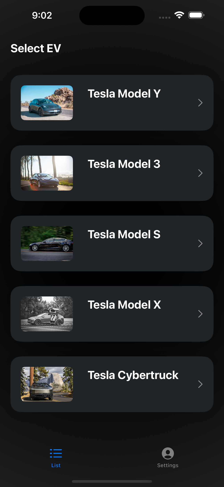

# Tesla Model X Checklist #

This checklist synthesizes advice from the Tesla Model X community, complementing Tesla's own quality checks by focusing on common issues that might slip through. It's designed to guide you through a detailed pre-delivery inspection, both exterior and interior, even if the vehicle is locked initially. Start with accessible checks, progressing methodically to ensure a thorough review.

Safety first: avoid inserting hands in unseen areas. Dedicate at least 90 minutes to this process, documenting any discrepancies for Tesla's attention before finalizing delivery. This step-by-step approach aims to ensure your vehicle meets your expectations before you leave the dealership.

---

Download the mobile application now available for iOS phones in the [App Store!](https://apps.apple.com/ca/app/electra-check/id6479584082)

<table>
  <tr>
    <td>
      
    </td>
    <td>
      
    </td>
  </tr>
</table>

---

Loved the guide? Supercharge your Tesla journey with my [referral link!](https://www.tesla.com/referral/david248286) It’s your pass to an electrifying adventure, supporting me to bring more cool insights. Let’s ride into the future together, stylishly and sustainably! 🚗💨

---

## Pre-Arrival Preparations ##

1. [ ] All individuals listed on the vehicle's registration must attend the delivery appointment to sign the final documents.
1. [ ] Bring a valid driver's license.
1. [ ] Have your smartphone with the Tesla app already installed and logged into.
1. [ ] Provide evidence (either in paper or digital format) of your down payment and the details of the final payment. If the purchase is financed, confirm that your loan has been fully processed before your arrival and be prepared to show proof of this financing to Tesla if requested.
1. [ ] Carry proof of insurance with you.
1. [ ] If you're trading in a vehicle, bring that car with you.
1. [ ] Bring a USB-C cable for testing purposes.

## Exterior Inspection - Locked ##

1. [ ] Verify that the paint color exactly matches your selection.
1. [ ] Look for the chrome 'Tesla' license plate frame to ensure it's present.
1. [ ] Make sure the front license plate mount is included.
1. [ ] Carefully examine the exterior paint and body for any imperfections or inconsistencies.
1. [ ] Check the underside of the vehicle for any signs of damage or scrapes.
1. [ ] Inspect the alignment of all body panels, paying special attention to critical areas such as the frunk and charge port for any misalignments or gaps.
1. [ ] Review all glass surfaces for any distortion, scratches, or cracks that may compromise visibility or aesthetics.
1. [ ] Assess the integrity of the edges around the roof and rear window, ensuring there are no irregularities.
1. [ ] Check all exterior lights to ensure there is no internal condensation, which could indicate a seal issue.

## Exterior Inspection - Unlocked ##

1. [ ] Confirm ownership by ensuring the Vehicle Identification Number (VIN) on the vehicle matches the one on your paperwork.
1. [ ] Check that the battery size, trim, wheel design, and seating capacity are as per your order.
1. [ ] Ensure you receive two key fobs and temporary tags are in place if required.
1. [ ] Verify the inclusion of the tire inflation kit and floor mats, if these were part of your purchase package.
1. [ ] Inspect the rear of the car to ensure the badge is correct and accurately reflects the model and specifications of your vehicle.
1. [ ] Test the functionality of all doors, the trunk, and frunk to ensure they open and close smoothly.
1. [ ] Confirm the auto-close features of the windows operate correctly and verify that all components of the tow hitch (if applicable) are present and in good working order.

## Interior Inspection ##

1. [ ] Ensure the interior color and materials correspond exactly to what you selected.
1. [ ] Confirm all options you purchased are installed and match the details listed in the Motor Vehicle Purchase Agreement (MVPA).
1. [ ] Check the vehicle's displays to ensure they accurately reflect your car's color and selected options.
1. [ ] Test the connectivity and functionality of all multimedia systems to ensure they're working properly.
1. [ ] Assess the operation of the mobile charger and the charging port cover for any issues.
1. [ ] Set up and test the HomeLink system with your garage door to confirm compatibility and functionality.
1. [ ] Verify that all doors, windows, and seats are fully operational, moving smoothly without any problems.
1. [ ] Look for any error messages on the display, test the HVAC (Heating, Ventilation, and Air Conditioning) system for proper functionality, and verify the sound system is operating correctly.
1. [ ] Examine the seat upholstery, all surfaces, and carpets to ensure they are of good quality and condition, without any damage or imperfections.

## Frunk Inspection ##

1. [ ] Open and close the frunk to ensure its mechanism operates smoothly and without any hitches.
1. [ ] Check that the clips securing the trim around the frunk are firmly in place and not loose.
1. [ ] Make sure the tow hook is included with the vehicle and is not missing, ensuring it's ready for use if ever needed.

## Trunk Inspection ##

1. [ ] Operate the lift gate to open and close, listening for any unusual clicks that might indicate issues with the weather seal.
1. [ ] Verify that the lift gate moves smoothly and consistently, ensuring the hatch button functions properly without issue.
1. [ ] Inspect the cargo covers to ensure they are correctly attached and secure.
1. [ ] Test the seat and trunk buttons to confirm they fold the back seats as intended.
1. [ ] Ensure that when folding, the rear seats do not catch on the trunk floor's carpeting, allowing for a smooth transition.
1. [ ] Check that the back seat covers are securely in place, with no risk of coming loose.
1. [ ] Confirm the presence of the J1772 adapter, essential for charging your vehicle at non-Tesla charging stations.
1. [ ] If your order included a tow hitch, make sure it is present and accounted for.

## Connectivity Evaluation ##

1. [ ] Test all USB ports and the 12-volt DC receptacle to ensure they are providing power correctly, indicating their readiness for use.
1. [ ] Confirm that the wireless phone charger operates as expected and that the key cards are functioning properly, allowing for seamless access and starting of the vehicle.
1. [ ] Verify the vehicle's Bluetooth connectivity to ensure your devices can connect without issues and test the multimedia streaming capabilities for uninterrupted entertainment and information access.

## Lighting System Check ##
1. [ ] Examine the operation of all interior and exterior lights for proper functionality.
1. [ ] Check for consistent illumination and operation of headlights, turn signals, and brake lights.

## Charging System Verification ## 

1. [ ] Inspect the charge port door and indicator light for proper alignment and functionality.
1. [ ] Test the vehicle’s ability to accept a charge using different adapters.
1. [ ] Verify functionality of the mobile charging kit and ensure compatibility with superchargers.

## Final Review ##

1. [ ] Verify that the vehicle's software is current, ensuring you have the latest features and security updates.
1. [ ] Thoroughly review operational aspects, including the efficiency of charging, the effectiveness of climate control, and the functionality of the infotainment system, to ensure they meet Tesla's standards and your expectations.
1. [ ] Investigate and address any potential concerns, such as signs of tire wear or excessive wind noise, which could indicate issues with installation or alignment.
1. [ ] Make sure all documentation related to your purchase is complete, accurate, and that your vehicle is officially registered as delivered in Tesla's system.